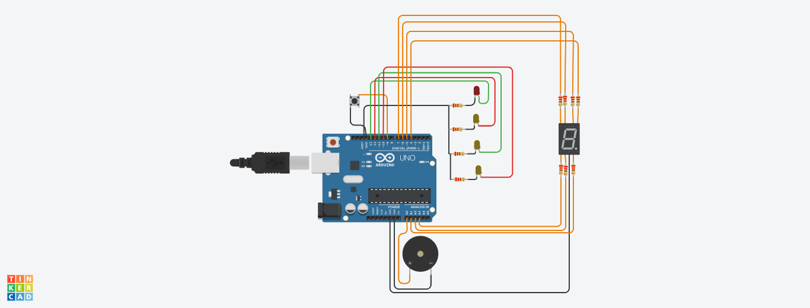

# Dojo2

## Integrantes 
- Sharlenne Azuaje Torres

## Proyecto: Subte.

## Descripción
Este sistema le permite al usuario saber a qué estación de subte está llegando, muestra las estaciones que faltan hasta llegar a un destino, y emite un sonido diferente cada vez que se llega a una estación.

## Funciones principales

1) La funcion prende el led número 4, hace sonar el buzzer y muestra por el display el número 0

~~~ C 
void EstacionMoreno()
{
  	Serial.println("Moreno");
    digitalWrite(LED_4, HIGH);
    tone(BUZZER, 800, 3000);
    EncenderDisplayCero(LED_A, LED_B, LED_C, LED_D, LED_E, LED_F, 3000);
    
    digitalWrite(LED_4, LOW);
	ApagarDisplayCero(LED_A, LED_B, LED_C, LED_D, LED_E, LED_F, 1000);
}
~~~

2) La funcion prende el led número 3, hace sonar el buzzer y muestra por el display el número 1

~~~ C 
void EstacionIndependencia()
{
  	Serial.println("Llegamos a Independencia");
    digitalWrite(LED_3, HIGH);
    tone(BUZZER, 50, 3000);
    EncenderDisplayUno(LED_B, LED_C, 3000);
    
    digitalWrite(LED_3, LOW);
    ApagarDisplayUno(LED_B, LED_C, 1000);
}
~~~

3) La funcion prende el led número 2, hace sonar el buzzer y muestra por el display el número 2

~~~ C 
void EstacionSanJuan()
{
  	Serial.println("Llegamos a San Juan");
    digitalWrite(LED_2, HIGH);
    tone(BUZZER, 200, 3000);
    EncenderDisplayDos(LED_A, LED_B, LED_D, LED_E, LED_G, 3000);
    
    digitalWrite(LED_2, LOW);
    ApagarDisplayDos(LED_A, LED_B, LED_D, LED_E, LED_G, 1000);
}
~~~

4) La funcion prende el led número 1, hace sonar el buzzer y muestra por el display el número 3

~~~ C 
void EstacionConstitucion()
{
  	Serial.println("Llegamos a Constitución");
    digitalWrite(LED_1,HIGH);
    tone(BUZZER, 440,3000);
    EncenderDisplayTres(LED_A, LED_B, LED_C, LED_D, LED_G, 3000);
    
    digitalWrite(LED_1, LOW);
    ApagarDisplayTres(LED_A, LED_B, LED_C, LED_D, LED_G, 1000);
}
~~~

## :robot: Link al proyecto
- [proyecto](https://www.tinkercad.com/things/0sEjMTV2qhj-dojo-numero-dos-parte-2-dojo-h/editel?sharecode=cGs-X6zOvj36nuJZor_cqGf5iU8A2Aloe9pJC9Z7jFs)
